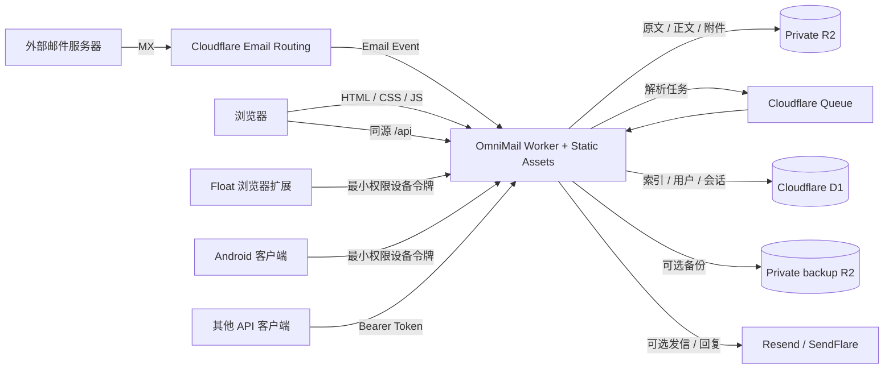

<p align="center">
  
</p>

<h1 align="center">OmniMail</h1>

<p align="center">
  基于 Cloudflare 构建的轻量、自托管、多域名 Webmail。
  <br>
  Git 驱动部署，邮件数据保留在你自己的 Cloudflare 账户中。
</p>

<p align="center">
  <a href="https://github.com/mibgb65-cloud/OmniMail/actions/workflows/ci.yml">
    
  </a>
  <a href="./LICENSE">
    
  </a>
  
  
  
</p>

> [!IMPORTANT]
> OmniMail `1.0` 是面向个人和小团队自托管场景的首个稳定兼容基线。
> 在承载重要邮件前，仍应完成独立安全审查、备份方案和真实邮件链路测试。

## 目录

- [版本与产品层级](#版本与产品层级)
- [为什么选择 OmniMail](#为什么选择-omnimail)
- [功能概览](#功能概览)
- [技术架构](#技术架构)
- [快速部署](#快速部署)
- [首次初始化](#首次初始化)
- [用户与权限](#用户与权限)
- [API 与客户端鉴权](#api-与客户端鉴权)
- [浏览器悬浮扩展](#浏览器悬浮扩展)
- [本地开发](#本地开发)
- [安全模型](#安全模型)
- [限制与路线图](#限制与路线图)
- [贡献](#贡献)
- [鸣谢](#鸣谢)
- [许可证](#许可证)

## 版本与产品层级

本仓库同时交付三个版本独立、职责不同的产品层。版本号只表示对应交付物的兼容阶段，
不能跨产品推断；例如 Web `1.0.0` 不会自动把 Android `0.x` 变成稳定版。

| 产品层 | 当前版本 | 支持层级 | 职责与兼容关系 |
| --- | --- | --- | --- |
| Web + Worker API | [`1.1.1`](https://github.com/mibgb65-cloud/OmniMail/releases/tag/v1.1.1) | 稳定兼容基线 | 核心服务、Webmail、数据和所有邮箱来源；自托管实例的唯一服务端 |
| OmniMail Float | [`1.0.0`](https://github.com/mibgb65-cloud/OmniMail/releases/tag/float-v1.0.0) | 稳定兼容基线 | Chrome Manifest V3 浏览器协作层；连接 Web/API `1.x`，不直连第三方邮箱 |
| Android | [`0.3.0`](https://github.com/mibgb65-cloud/OmniMail/releases/tag/android-v0.3.0) | 独立预览版 | 原生移动客户端；仍处于 `0.x`，兼容承诺和发布节奏独立于 Web/Float |

### 支持层级

- **稳定兼容基线**：Web/API 与 Float 的 `1.x` 会保持已公布来源 ID、账号状态、能力字段、
  工作区路径和通知深链接向后兼容；破坏性变更必须进入新的主版本并提供迁移说明。
- **可选邮箱集成**：iCloud、Linux DO、Gmail、Microsoft、QQ、NAVER 与 Yandex 依赖
  第三方服务能力和实例配置。NAVER、Yandex 仍按灰度流程开放，稳定版本号不取消真实账号
  验收、低频观察或紧急关闭开关。
- **独立预览版**：Android `0.x` 可用于测试和日常验证，但不继承 Web/Float `1.x` 的完整
  稳定契约；升级前应阅读对应 Android Release Notes。

### 1.x 兼容边界

- Web `1.1.0 → 1.1.1` 修复首次部署与 D1 定位，不新增数据库迁移、变量、Secret 或 API 变更。
  更新代码后使用 `npm run deploy`；详见 [Web 1.1.1 发布说明](docs/releases/web/v1.1.1.md)。
- Web `1.0.2 → 1.1.0` 需要应用 `0036`、`0037` 数据库迁移，使用 `npm run deploy` 自动处理。
  全局密钥为可选配置，旧独立密钥继续兼容；启用全局密钥后须保留旧密钥直到历史凭据迁移完成。
  完整升级步骤与回滚限制见 [Web 1.1.0 发布说明](docs/releases/web/v1.1.0.md)。

- Float `1.x` 推荐连接 Web/API `1.x`；升级时先部署 Web，再更新扩展。
- Float `0.8.1 → 1.0.0` 不增加 Chrome 权限或设备 Scope，不需要重新授权；Web
  `0.10.4 → 1.0.0` 不新增 D1 迁移、变量、Secret 或资源绑定。
- `1.0` 的“稳定”指已记录的 Web/Float 产品契约，不代表企业 SLA、端到端加密、合规归档
  或高可用保证。
- 当前未带版本前缀的 `/api/*` 主要服务于同仓库客户端；面向第三方的通用稳定 HTTP API
  将通过后续 `/api/v1` 单独承诺。

完整的来源矩阵与字段协议见
[`extension/COMPATIBILITY.md`](./extension/COMPATIBILITY.md)，各产品的独立发布记录见
[`docs/releases`](./docs/releases/README.md)。

## 为什么选择 OmniMail

OmniMail 面向已经将域名托管在 Cloudflare、希望拥有独立域名邮箱工作台的用户。
它不是传统 IMAP 邮箱服务器，而是一套围绕 Cloudflare Email Routing 构建的
Serverless Webmail：

| 特点 | 说明 |
| --- | --- |
| 数据归属自己 | D1、R2、Queue 和 Worker 都运行在你的 Cloudflare 账户中 |
| 一体化 Git 部署 | 一次构建同时发布 React 静态前端与 Worker API |
| 多域名与多邮箱 | 一个实例统一管理多个域名、用户和收件地址 |
| 完整权限模型 | 主管理员、管理员、普通用户和限时临时用户 |
| 可选发信能力 | 通过 Resend 或 SendFlare 新建邮件与回复；不配置时仍可正常收件 |
| Web 与桌面共用 API | 浏览器使用安全 Cookie，桌面客户端使用 Access / Refresh Token |
| 网页悬浮邮箱 | 可选 Chrome 扩展用于生成邮箱、填入网页、收件与后台通知 |
| iCloud 隐藏邮箱 | 可选接入 iCloud+ Hide My Email，管理别名并按需读取最近来信 |
| Gmail 聚合收件箱 | 连接多个 Gmail / Workspace 账号，搜索聚合的 INBOX 元数据并在打开后同步已读 |
| QQ 邮箱聚合收件箱 | 使用授权码连接多个个人 QQ 邮箱，有限同步 INBOX，并通过官方 SMTP 新建或回复邮件 |
| NAVER 邮箱聚合收件箱 | 使用应用专用密码连接个人 NAVER 邮箱，有限同步 INBOX 并按需读取正文与附件 |
| Yandex 邮箱聚合收件箱 | 使用 Mail 应用密码连接个人 Yandex 邮箱，有限同步 INBOX 并按需读取正文与附件 |
| 管理可观测性 | 收件统计、来源分析、操作日志和部署自检 |

## 功能概览

### 邮件

- Cloudflare Email Routing + Catch-all 收件
- 可选无人收件：未创建地址的邮件统一进入主管理员收件箱
- Cloudflare Queue 异步解析，避免阻塞收件事件
- 收件箱、星标、已发送和垃圾箱
- 标准邮件头驱动的会话线程视图与最多 50 封批量操作
- HTML / 纯文本正文查看
- 私有附件与原始 `.eml` 下载
- 按域名、邮箱地址、发件人、主题与正文搜索
- 稳定游标分页、自适应自动刷新与跨标签页轮询合并
- Resend / SendFlare 主动发信、线程内快速回复、队列投递及用户级限速
- 新邮件和快速回复均可添加最多 5 个附件；单个不超过 5 MiB，合计不超过 10 MiB
- 左侧草稿箱默认保留最近 5 封未发送邮件，管理员可按用户级别设置 1–20 封上限；
  草稿附件随草稿自动保存
- Webmail 打开期间可选浏览器新邮件通知

### iCloud 隐藏邮箱

- 每个 OmniMail 用户可以连接自己的 `icloud.com` 或 `icloud.com.cn` 账号
- 同步、创建、停用、恢复和删除 iCloud+ Hide My Email 地址
- 应用专用密码可通过 iCloud IMAP 按隐藏地址筛选并读取完整正文；IMAP 不可用时，
  全部邮件视图会回退到 iCloud Web 摘要
- iCloud Cookie 与应用专用密码使用 AES-GCM 加密后保存到 D1，密文绑定用户、账号
  与字段，读取接口只返回“已配置”状态
- iCloud 邮件按需从 Apple 读取，不会复制到 OmniMail 的 D1 / R2，也不进入现有收件箱

#### iCloud 使用注意事项

- 仅支持已开通 iCloud+ 且拥有 **Hide My Email** 权限的 Apple 账号；“仅网页访问”、未开通 iCloud+ 或没有隐藏邮箱权限的账号无法添加。
- 添加账号时需要从对应的 `icloud.com` / `icloud.com.cn` 会话导入 Cookie。Cookie 过期、复制不完整或 Apple 拒绝权限时，添加会失败并在弹窗显示原因，不会退出 OmniMail 当前登录账号。
- `MAIL_CREDENTIALS_KEY`（或兼容的 `ICLOUD_CREDENTIALS_KEY`）必须配置为至少 32 字节的 Secret；更换或恢复部署时请确认该 Secret 没有丢失，否则无法解密已保存凭据。
- `MAIL_CREDENTIALS_KEY`（或兼容的 `LINUX_DO_MAIL_CREDENTIALS_KEY`）必须配置为至少 32 字节的 Secret；它用于加密 Linux DO Mail 密码或认证令牌。
- 应用专用密码不是创建隐藏邮箱的必需项；只有需要通过 IMAP 按地址筛选或读取完整邮件正文时才需要配置，并且必须绑定当前 iCloud 邮箱。
- iCloud 邮件和别名由 Worker 按需访问 Apple，不会同步进 OmniMail 收件箱；Apple 服务、订阅状态、区域限制和请求频率可能影响读取结果。
- 不要把 Cookie 或应用专用密码提交到 Git、截图、工单或第三方聊天中；OmniMail 只在 Worker 内加密保存，浏览器不会再次读取原值。

### Gmail 聚合收件箱

- 每个 OmniMail 用户可连接多个自己有权访问的 Gmail 或 Google Workspace 账号。
- 固定连接 `imap.gmail.com:993`。后台同步使用 `EXAMINE`、受控 `UID SEARCH` / `UID FETCH`；
  用户打开正文后只允许执行固定的 `UID STORE ... +FLAGS.SILENT (\Seen)` 标记已读。
- 不开放星标、归档、移动、删除或发送邮件等其他远端写操作。
- D1 每个账号首次索引最近 100 封、最多保留最近 500 封 INBOX 元数据；正文、内嵌图片
  和附件仅在用户打开时读取，不持久化到 D1 / R2。
- 搜索框在当前账号或全部账号的 D1 索引中匹配发件人、收件人和主题，
  不会为搜索额外下载或持久化 Gmail 正文。
- 每 5 分钟由 Cron 错峰加入 Queue，同一账号通过短时租约避免并发同步；账号失败不会阻断
  其他 Gmail 账号或 OmniMail 主邮箱。
- 应用专用密码使用 `MAIL_CREDENTIALS_KEY`（或兼容的 `GMAIL_CREDENTIALS_KEY`）进行 AES-GCM 加密，密文上下文绑定
  用户、账号和字段；API 只返回 `hasAppPassword: true`。

#### Gmail 使用注意事项

- Google 官方优先推荐“使用 Google 账号登录”；OmniMail 为保持纯自托管部署而提供应用专用
  密码模式。应用密码本身不具备细粒度 scope，远端操作边界由 OmniMail 的命令白名单保证。
- 应用专用密码要求先开启两步验证，并且某些 Workspace、Advanced Protection 或仅安全密钥
  两步验证账号无法创建。请勿填写 Google 账号主密码。
- Google 账号主密码变化时，现有应用密码会被撤销。连接失效后需生成新密码并在账号管理中更新。
- 删除 OmniMail 本地连接只会删除密文和索引；还必须前往
  [Google 应用专用密码](https://myaccount.google.com/apppasswords)手动撤销对应密码。
- 个人 Gmail 的 IMAP 默认开启；Workspace 是否允许第三方 IMAP 和应用密码仍由组织策略决定。

### Microsoft 邮箱（仅已读写入）

- 每个 OmniMail 用户可连接多个 Outlook.com、Hotmail、Live，或租户允许 IMAP 的
  Microsoft 365 委托式账号；首期只支持 Azure Global。
- OAuth2 是唯一认证路径：Worker 只向 Microsoft 官方 token endpoint 兑换 access token，随后
  固定连接 `outlook.office365.com:993` 并使用 IMAP XOAUTH2。仅邮箱密码导入与 LOGIN 已停用。
- 工作区可以聚合 INBOX，也可选择单账号的服务器文件夹，按 1–200 条读取元数据。全部范围可把
  所有账号逐个加入同步 Queue，单账号范围可直接刷新当前文件夹；复制按钮在全部范围默认复制
  第一个账号邮箱。正文、CID 图片与最大 5 MiB 附件仅在打开时通过 `BODY.PEEK[]` 读取，不长期保存。
- Cron 约每 5 分钟将到期 INBOX 同步加入 Queue；这是定时收信，不是秒级推送。打开未读邮件会在
  正文读取成功后同步 `\Seen`；除此之外不提供发信、删除、移动、归档或星标等远端写操作。
- refresh token、短期 access token与经确认留存的四字段组合 password 使用独立
  `MICROSOFT_CREDENTIALS_KEY` 进行 AES-GCM 加密；组合 password 不参与认证，API、日志与审计
  记录也不会返回敏感凭据。

详细部署、OAuth scope、导入格式与真实账号验收步骤见
[Microsoft 邮箱设置指南](docs/MICROSOFT_SETUP.md)。

### QQ 邮箱

- 每个 OmniMail 用户可连接多个个人 `@qq.com` 收件账号；同一账号可添加经过 QQ SMTP 验证的
  英文 `@qq.com`、`@foxmail.com` 与 `@vip.qq.com` 发信身份，腾讯企业邮箱不在支持范围。
- 用户先在 QQ 邮箱中开启 IMAP/SMTP 服务并生成授权码，OmniMail 固定连接
  `imap.qq.com:993` TLS；不接受 QQ 登录密码或自定义服务器。
- 首次只索引最近 100 封、每账号最多保留 500 封 INBOX 元数据；正文与最大 5 MiB 附件按需
  读取且不持久化。打开正文后仅尝试精确写入 `\\Seen`，不支持移动、删除、归档或星标。
- 可从所选 QQ 账号向单个收件人新建或回复邮件；写信时可选择已验证身份，发件固定连接
  `smtp.qq.com:465` 直接 TLS，并复用 Queue、幂等、限速和审计链路。
- 授权码由 `MAIL_CREDENTIALS_KEY`（或兼容的 `QQ_MAIL_CREDENTIALS_KEY`）使用 AES-GCM 加密，API 只返回
  `hasAuthorizationCode: true`；单账号故障不会阻断其他账号或其他邮件工作区。

部署和真实账号验收步骤见 [QQ 邮箱设置指南](docs/QQ_MAIL_SETUP.md)。

### NAVER 邮箱（灰度、只读）

- 仅支持个人 `@naver.com` 邮箱；用户需先开启 NAVER 两步验证和 IMAP/SMTP，并生成独立的
  应用专用密码。OmniMail 固定连接 `imap.naver.com:993`，不接受登录主密码或自定义服务器。
- 首次索引最近 100 封、每账号最多保留 500 封 INBOX 元数据，默认每 15 分钟加入同步 Queue；
  正文与最大 5 MiB 附件按需读取且不持久化。
- 打开正文后仅尝试精确写入 `\\Seen`；不支持发信、删除、移动、归档、星标或文件夹管理。
- 应用专用密码由 `MAIL_CREDENTIALS_KEY`（或兼容的 `NAVER_MAIL_CREDENTIALS_KEY`）使用 AES-GCM 加密，API 只返回
  `hasAppPassword: true`。入口默认隐藏，生产开放前必须完成真实 Worker 登录和 24 小时稳定性观察。

部署、灰度闸门和真实账号验收步骤见 [NAVER Mail 设置指南](docs/NAVER_MAIL_SETUP.md)。

### Yandex 邮箱（灰度、只读）

- 首版仅支持个人 `@yandex.com` 邮箱，使用 Yandex ID 中为“邮件”创建的应用密码。
- OmniMail 固定连接 `imap.yandex.com:993`；登录名从邮箱本地部分派生，不接受主密码、自定义
  服务器、企业自定义域名或共享邮箱技术用户名。
- 首次索引最近 100 封、每账号最多保留 500 封 INBOX 元数据，默认每 15 分钟加入同步 Queue；
  正文与最大 5 MiB 附件按需读取且不持久化。
- 打开正文后仅尝试精确写入 `\Seen`；不支持发信、删除、移动、归档、星标或文件夹管理。
- 应用密码由 `MAIL_CREDENTIALS_KEY`（或兼容的 `YANDEX_MAIL_CREDENTIALS_KEY`）使用 AES-GCM 加密；入口和部署开关默认关闭。

部署和灰度验收步骤见 [Yandex Mail 设置指南](docs/YANDEX_MAIL_SETUP.md)。

### 多域名与用户

- 多域名集中管理，支持启用、停用和安全删除
- 每个域名可创建多个独立邮箱地址
- 用户级邮箱额度、创建权限和发信权限
- 用户级存储配额与空间使用统计
- 用户封禁、解封及会话即时失效
- 管理员指定邮箱或用户自选前缀的普通/临时用户邀请
- 临时账号独立有效期、到期停用和延迟数据清理

### 管理与安全

- 邮箱密码登录和 Worker 配置驱动的主管理员
- 可选邮箱密码注册、Linux DO Connect 第三方注册与注册限速
- 注册邮箱后缀允许列表 / 禁止列表
- 短期 Access Token、轮换 Refresh Token 和设备会话
- 登录与敏感操作审计日志
- 收件趋势、来源域名与高频发件人统计
- 亮色、暗色及跟随系统主题
- 简体中文与英文界面，支持浏览器语言识别和手动切换
- 首次运行检查和三步部署初始化向导
- 系统设置显示当前版本，并检查 GitHub Releases 更新
- 管理员可选 D1 / 邮件归档备份、保留周期、备份浏览下载、只读恢复演练、
  存储统计与安全批量清理
- 桌面、平板和手机响应式布局

## 技术架构



| 层级 | 技术 |
| --- | --- |
| Web | React、TypeScript、Vite |
| API | Cloudflare Workers、Hono |
| Float | React、TypeScript、Chrome Manifest V3 |
| Android | Kotlin、Jetpack Compose、Room、WorkManager |
| 数据库 | Cloudflare D1 |
| 对象存储 | Cloudflare R2 |
| 异步任务 | Cloudflare Queues、Workflows |
| 收件 | Cloudflare Email Routing |
| 发信与回复 | Resend 或 SendFlare（可选） |
| 防护 | Cloudflare Turnstile（邮箱密码注册或多人邀请时） |

### 仓库结构

```text
.
├── src/                       # React Webmail
│   ├── app/                   # 应用装配、导航与全局样式
│   ├── features/              # 邮箱、消息、认证、管理等业务功能
│   ├── shared/                # API、i18n、通用邮件与 UI 能力
│   └── main.tsx               # Web 稳定入口
├── public/                    # Worker Static Assets 与安全响应头
├── extension/                 # OmniMail Float 浏览器扩展、商店资料与兼容契约
├── android/                   # 独立版本的原生 Android 客户端
├── email-worker/
│   └── src/
│       ├── app/               # Hono 装配、中间件与路由
│       ├── features/          # Provider 与 Worker 业务功能
│       ├── platform/          # D1、IMAP 与调度适配
│       ├── shared/            # Worker 跨功能基础能力
│       └── index.ts           # Worker 稳定入口
├── migrations/                # 可审阅的 D1 迁移
├── docs/API.md                # HTTP API 文档
├── docs/ARCHITECTURE.md       # 代码目录和依赖边界约定
├── scripts/                   # 仓库质量检查脚本
├── wrangler.jsonc             # Worker、静态前端与 Cloudflare 资源配置
└── .github/workflows/ci.yml   # GitHub Actions
```

详细的文件归属和新增功能约定见 [`docs/ARCHITECTURE.md`](./docs/ARCHITECTURE.md)。

## 快速部署

### 前置条件

- Cloudflare 账户，以及已托管在 Cloudflare DNS 的域名
- GitHub 账户
- Node.js 22+（仅本地开发需要）
- Resend 或 SendFlare 账户（可选，用于主动发信与回复）

> [!TIP]
> 如果根域名已经承载其他邮件服务，建议先使用专用子域测试，例如
> `inbox.example.com`，不要直接替换现有 MX 记录。

前端和 API 使用同一个 Worker 域名：

```text
Webmail + API  https://mail.example.com
API path       https://mail.example.com/api/*
```

同源部署不需要额外的 Pages 项目或独立 API 域名，登录 Cookie 和 CORS 配置也更简单。

### 一键部署（独立快照）

[](https://deploy.workers.cloudflare.com/?url=https://github.com/mibgb65-cloud/OmniMail)

Cloudflare 会把仓库导入你的 GitHub 账户，创建并绑定 D1、R2、Queue 等资源，提示填写
`SETUP_TOKEN` 和 `SUPER_ADMIN_EMAIL`，然后通过 Workers Builds 完成构建、数据库迁移
和 Worker 部署。

> [!NOTE]
> Deploy to Cloudflare 会创建一个独立 Git 仓库，而不是 GitHub Fork。该仓库不会显示
> **Sync fork**，也不会自动同步上游提交或 Release Tag。此方式适合快速试用；需要
> 持续获取后续更新时，请使用下一节的 Fork 部署流程。

> [!IMPORTANT]
> 一键部署不会修改域名 DNS、MX 或 Email Routing。Worker 部署完成后，仍需继续完成
> [配置 Worker](#3-配置-worker)和[启用 Email Routing](#4-启用-email-routing)。

### Fork 后部署（支持同步更新，长期使用推荐）

#### 1. 创建 Fork

打开 [Fork OmniMail](https://github.com/mibgb65-cloud/OmniMail/fork)，在 GitHub 中创建
Fork。创建完成后，仓库标题下方应显示 `forked from mibgb65-cloud/OmniMail`，然后让
Cloudflare Worker 连接这个 Fork。

如果使用本地 Git：

```bash
git clone https://github.com/YOUR_NAME/OmniMail.git
cd OmniMail
```

#### 2. 连接 Cloudflare Worker

在 Cloudflare Dashboard 中进入 **Workers & Pages → Create application →
Import a repository**，选择你的 OmniMail 仓库：

| 项目 | 值 |
| --- | --- |
| Project name | `omni-mail` |
| Production branch | `main` |
| Root directory | `/` |
| Build command | `npm run build` |
| Deploy command | `npm run deploy` |
| Non-production branch builds | 首次部署暂时关闭 |
| API token | 让 Cloudflare 自动创建 |

无论使用独立快照一键部署还是导入 Fork，第一次部署都会依据
[`wrangler.jsonc`](./wrangler.jsonc) 完成两件事：

1. `npm run build` 将 React 前端生成到 `dist/`。
2. `npm run deploy` 先读取目标 Worker 的实际 `DB` 绑定 ID，检查并应用尚未执行的 D1
   迁移，再由 Wrangler 将 `dist/`、Worker API、资源和定时任务作为同一个 Worker 版本发布。
   首次自动创建的 D1 数据库统一命名为 `omni-mail-db`；先创建并绑定资源，再按实际 ID
   初始化数据库并校验迁移记录。已有用户的数据库名称及数据保持原样。
   在此首次初始化完成前，API 可能短暂提示数据库迁移未完成。

部署命令请使用 **`npm run deploy`**。单独运行 `npx wrangler deploy` 只发布 Worker，
不会调用本项目的迁移脚本；如果网站已提示“D1 数据库迁移未完成”，把 Workers Builds
的 Deploy command 改为 `npm run deploy` 后重新部署即可。本地发布需先运行 `npm run build`。

部署脚本对网络中断、限流、Cloudflare 服务临时故障最多尝试 **5 次**，间隔为
2、4、8、16 秒并附加随机延迟。迁移失败后会重新读取迁移记录，再决定需要执行哪些
SQL；远端已经成功但响应丢失时，不会重复执行已记录的迁移。权限、配置或 SQL 错误会
显示具体原因并停止；例如构建 API Token 需要具备相应账户的 **D1 编辑权限**。
首次资源创建成功但迁移失败时，修复原因后重新运行同一命令可继续完成部署。

#### D1 名称与绑定兼容

Worker 默认名称是 `omni-mail`，代码中的 D1 绑定名始终是 `DB`。首次自动创建数据库使用
`omni-mail-db`；已有用户的库即使叫 `omnimail-db` 或其他名称，也会按线上 `DB` 实际绑定的
数据库 ID 迁移和部署，不要求改名。`npm run db:migrate` 的远程迁移同样先解析实际绑定。

部署脚本会识别 Workers Builds 的实际 Worker 名称覆盖，保留 `--env`、`--config`、
`--env-file` 和 `--profile`，在源配置旁生成本次使用的临时配置；两步共用同一个数据库 ID，
结束后删除临时文件，不改写仓库的 `wrangler.jsonc`。

Cloudflare 可能在首次构建前已创建 Worker 和初始化变量，但尚未绑定 `DB`。此时
`npm run deploy` 会核对 `omni-mail-db` 和历史名称 `omnimail-db` 是否已存在；无冲突时
自动创建并绑定 `omni-mail-db`，随后执行全部建表迁移并校验结果。账号中其他服务的 D1
不影响首次部署，不需要删除，也不会被自动选为 OmniMail 的数据库。

Worker 缺少 `DB` 且存在上述同名库时，脚本会提示恢复绑定或在配置中显式填写确认过的
`database_id`；不会自动复用。同样，使用自定义库名的旧部署若丢失绑定，应先恢复绑定或
显式指定原库 ID。显式 ID 经核验后也可补齐缺失绑定。已有绑定类型或 ID 无效、显式 ID
冲突、无法唯一确定账户或权限不足时仍会停止。无需删除或重建原数据库。

构建凭据需可读取目标 Worker 绑定，并具备目标账户的 D1 编辑权限。无法确定账户时设置
`CLOUDFLARE_ACCOUNT_ID`；账户 ID 和 Worker 名称等部署目标变量使用明确值，不使用环境插值。

`npm run deploy -- --dry-run` 只做打包预检，不执行远程数据库迁移或创建资源。
使用命名环境时，`npm run deploy -- --env staging` 会将环境同时传给迁移和发布步骤。

`/api/*` 优先交给 Worker 脚本，其余路径由 Static Assets 提供；未匹配的浏览器
导航会回退到 `index.html`，因此 React SPA 刷新不会出现 404。

Cloudflare Workers Builds 会在 `main` 更新后自动拉取、构建并部署，不需要在
GitHub Actions 中重复配置 Cloudflare API Token。GitHub Actions 只负责运行测试、
类型检查和部署预检。

#### Float 与 Android 更新的构建过滤

本仓库同时包含 Web/Worker、OmniMail Float 与 Android App。为了避免只修改 Float
或 Android 代码时仍重新部署网站，请在 Cloudflare Dashboard 的 **Workers & Pages
→ omni-mail → Settings → Build → Build watch paths** 中设置：

```text
Includes:
*

Excludes:
android/*
docs/releases/android/*
.github/workflows/android-release.yml
extension/*
docs/releases/float/*
.github/workflows/float-release.yml
```

纯 Float 或 Android 更新会因此跳过 Workers Builds；如果同一次提交还修改了 Web 或
Worker 文件，剩余路径仍会匹配 `*` 并正常部署。Build watch paths 属于 Cloudflare
项目配置，不会写入 `wrangler.jsonc`，新建或迁移项目时需要手动复现。更多规则参见
[Cloudflare Build watch paths](https://developers.cloudflare.com/workers/ci-cd/builds/build-watch-paths/)。

#### 后续同步上游更新

原仓库发布更新后，在自己的 Fork 页面选择 **Sync fork → Update branch**。GitHub
会把上游提交同步到 Fork 的 `main`；Workers Builds 检测到新提交后会自动运行上述
构建、D1 迁移和部署命令。存在冲突时，先按 GitHub 提示创建 Pull Request 并人工解决，
不要强制覆盖包含自定义修改的生产分支。

### 3. 配置 Worker

#### 必需配置

| 名称 | 类型 | 用途 | 示例 |
| --- | --- | --- | --- |
| `SETUP_TOKEN` | Secret | 首次创建主管理员的一次性令牌 | 至少 32 字节随机值 |
| `SUPER_ADMIN_EMAIL` | Text | 主管理员登录邮箱 | `owner@example.com` |

#### 可选配置

| 名称 | 类型 | 用途 |
| --- | --- | --- |
| `APP_NAME` | Text | 自定义站点名称，默认 `OmniMail` |
| `COOKIE_SECURE` | Text | 生产环境保持 `true`；仅本地 HTTP 使用 `false` |
| `APP_ORIGINS` | Text | 允许访问 API 的额外跨域前端、开发版或其他扩展 ID；商店版由系统设置开关管理 |
| `TURNSTILE_SITE_KEY` | Text | Turnstile 公开 Site Key |
| `TURNSTILE_SECRET_KEY` | Secret | Turnstile 私密 Secret Key |
| `LINUX_DO_CLIENT_ID` | Text | Linux DO Connect Client ID |
| `LINUX_DO_CLIENT_SECRET` | Secret | Linux DO Connect Client Secret |
| `RESEND_DOMAIN_CONFIGS` | Secret | 按发件域名配置独立的 Resend API Key 与可选发件人 |
| `RESEND_WEBHOOK_SECRET` | Secret | 单个 Resend Webhook 的 Signing Secret（兼容旧配置） |
| `RESEND_WEBHOOK_SECRETS` | Secret | 多个 Resend Webhook Signing Secret 组成的 JSON 数组 |
| `SENDFLARE_API_KEY` | Secret | SendFlare 全局主动发信与回复 |
| `SENDFLARE_FROM` | Text | 可选固定发件邮箱地址，例如 `reply@example.com` |
| `SENDFLARE_DOMAIN_CONFIGS` | Secret | 按发件域名配置独立的 SendFlare API Key 与可选发件邮箱 |
| `TOTP_ENCRYPTION_KEY` | Secret | 至少 32 个随机字符，用于加密管理员 TOTP 密钥 |
| `MAIL_CREDENTIALS_KEY` | Secret | 推荐：至少 32 个随机 UTF-8 字节，统一加密全部外部邮箱凭据；旧部署可继续使用下列独立密钥 |
| `ICLOUD_CREDENTIALS_KEY` | Secret | 至少 32 字节，用于加密 iCloud Cookie 与应用专用密码；不使用 iCloud 功能时可留空 |
| `LINUX_DO_MAIL_CREDENTIALS_KEY` | Secret | 至少 32 字节，用于加密 Linux DO Mail 密码或认证令牌；不使用该功能时可留空 |
| `GMAIL_CREDENTIALS_KEY` | Secret | 至少 32 字节，只用于加密 Gmail 应用专用密码；不使用该功能时可留空 |
| `GMAIL_IMAP_ENABLED` | Text | 可选紧急功能开关；设为 `false` 时隐藏并停止 Gmail 接入，默认启用 |
| `QQ_MAIL_CREDENTIALS_KEY` | Secret | 至少 32 字节，只用于加密 QQ 邮箱授权码；不使用该功能时可留空 |
| `QQ_MAIL_IMAP_ENABLED` | Text | 可选紧急功能开关；设为 `false` 时隐藏并停止 QQ 邮箱接入，默认启用 |
| `NAVER_MAIL_CREDENTIALS_KEY` | Secret | 至少 32 字节，只用于加密 NAVER 应用专用密码；不使用该功能时可留空 |
| `NAVER_MAIL_IMAP_ENABLED` | Text | NAVER 功能开关；仅设为 `true` 时启用，完成真实账号验收前保持 `false` |
| `MICROSOFT_CREDENTIALS_KEY` | Secret | 至少 32 字节，用于加密 Microsoft OAuth token 与可选组合 password；不使用该功能时可留空 |
| `MICROSOFT_MAIL_ENABLED` | Text | 可选紧急功能开关；设为 `false` 时隐藏并停止 Microsoft 接入，默认启用 |
| `CLOUDFLARE_ACCOUNT_ID` | Text | 可选备份所需的 Cloudflare Account ID |
| `UPDATE_REPOSITORY` | Text | Release 来源仓库，默认 `mibgb65-cloud/OmniMail` |
| `D1_DATABASE_ID` | Text | 可选备份所需的生产 D1 Database ID |
| `D1_REST_API_TOKEN` | Secret | 可选备份所需、仅授予 D1 Edit 的专用 API Token |

把 `RESEND_DOMAIN_CONFIGS` 设为 JSON Secret，为每个发件域名指定对应的 API Key。
只有一个域名时只需要一个条目：

```json
{
  "openai.com": { "apiKey": "re_openai" }
}
```

多个域名时合并到同一个 JSON 对象中：

```json
{
  "openai.com": { "apiKey": "re_openai" },
  "closeai.com": {
    "apiKey": "re_closeai",
    "from": "OmniMail <reply@closeai.com>"
  }
}
```

推荐使用 `apiKey`；也兼容 `apikey` 写法。域名匹配不区分大小写，并使用精确匹配，
未配置的域名不能通过 Resend 发信。没有设置 `from` 时，用户选择的邮箱会作为发件人；
设置固定发件人时，用户选择的邮箱仍作为 Reply-To。每个发件域名都需要在对应的
Resend 账户中完成验证。API Key 应通过 Cloudflare Secret 保存。配置不是合法 JSON
或任一域名缺少 `apiKey`/`apikey` 时会禁用 Resend 发信。

SendFlare 可以通过全局 Secret 配置：

```text
SENDFLARE_API_KEY=sf_example
SENDFLARE_FROM=reply@example.com
```

使用前先在 [SendFlare Projects](https://app.sendflare.com/projects) 验证发件域名，并在
[API Keys](https://app.sendflare.com/apiKeys) 创建访问令牌。

也可以按域名配置不同 SendFlare 账户：

```json
{
  "example.com": { "apiKey": "sf_example", "from": "reply@example.com" },
  "another.example": { "apiKey": "sf_another" }
}
```

将上述 JSON 保存为 `SENDFLARE_DOMAIN_CONFIGS` Secret。匹配的 SendFlare 域名配置优先
于 Resend；其余域名继续使用匹配的 Resend 域名配置，最后才回退到全局
`SENDFLARE_API_KEY`。SendFlare 的 `from` 必须是
已验证域名下的纯邮箱地址，不能使用 `名称 <邮箱>` 格式。

SendFlare 当前发送接口没有附件字段。含附件邮件若存在可用 Resend 配置，会自动改用
Resend；否则任务会明确失败，不会丢弃附件后继续发送。

发信请求会先持久化并进入 Queue，再由后台任务调用选定的发信服务。
主动发件、草稿发送与回复按用户合并限速，默认每分钟最多 10 封、每个 UTC 自然日
最多 200 封。管理员可以在系统设置中修改全局开关和默认值，并在用户管理中设置
单用户覆盖值、查看当前窗口用量或清零计数。超过限制时接口返回 `429` 和
`Retry-After`；使用相同幂等键重试不会重复计数。

Resend 请求会携带服务端幂等键。SendFlare 当前文档未提供幂等参数；OmniMail 可以避免
重复入队，但若 SendFlare 已接收请求后网络在返回响应前中断，队列重试仍可能产生重复邮件。

若要同步送达、延迟、退信、投诉和抑制状态，请在 Resend 创建 Webhook：

```text
https://你的域名/api/webhooks/resend
```

选择 `email.sent`、`email.delivered`、`email.delivery_delayed`、`email.bounced`、
`email.complained`、`email.failed` 与 `email.suppressed`。单个 Resend 账户可把 Signing
Secret 保存为 `RESEND_WEBHOOK_SECRET`。多个账户都使用同一端点，并把各账户生成的
Signing Secret 以 JSON 数组保存为 `RESEND_WEBHOOK_SECRETS`：

```json
["whsec_account_one", "whsec_account_two"]
```

两个变量可以同时设置，便于从单账户配置迁移；重复值会自动去除。Webhook 未配置时
仍可发信，但只能显示发信服务已接受请求。

管理员可在 **账号设置 → 管理员二次验证** 中启用验证器应用。启用时生成的恢复码只
显示一次；TOTP 密钥经过 `TOTP_ENCRYPTION_KEY` 加密后才写入 D1。更换此 Secret 前
应先让管理员停用二次验证，否则旧密钥无法解密；恢复码仍可用于解除锁定。

同一个 Worker 提供的前端会被自动允许，不需要设置 `APP_ORIGINS`。主管理员可在
**系统设置 → 官方浏览器扩展** 中直接允许 Chrome Web Store 固定版本；只有另一个
Web 前端、开发版或其他扩展 ID 需要跨域调用 API 时才配置 `APP_ORIGINS`。它支持
英文逗号分隔的精确来源，不能使用 `*`。
Secret 只能保存在 Cloudflare Variables & Secrets，不要写入 GitHub 仓库。

### 版本检查与 Fork 更新

**系统设置 → 系统版本** 会检查最新正式 Release，但不会在应用内自动更新。发现新版本
后，界面会引导管理员前往 GitHub 查看变更；请按照[后续同步上游更新](#后续同步上游更新)
中的步骤，在自己的 Fork 页面选择 **Sync fork → Update branch**。Cloudflare Workers
Builds 检测到分支更新后会自动构建、迁移并重新部署。

修改过源码且存在冲突的 Fork 应通过 Pull Request 手动合并、测试并部署，避免覆盖
自定义改动。一键部署生成的独立快照没有 **Sync fork**，长期使用时建议迁移到 Fork
部署；继续使用快照则需要自行合并上游更新。

若要启用 Linux DO 登录，请在 [Linux DO Connect](https://connect.linux.do) 申请应用，
将回调地址设置为 `https://你的域名/api/auth/linux-do/callback`，再配置上表两个变量。
管理员随后可在 **系统设置 → 外部注册** 中选择“仅 Linux DO”。现有账号仍可使用
邮箱密码登录；公开注册的新用户默认可在已启用域名中选择 1 个尚未占用的邮箱地址。

若要启用独立的 **Linux DO 邮箱** 工作区，配置统一
`MAIL_CREDENTIALS_KEY`（兼容原 `LINUX_DO_MAIL_CREDENTIALS_KEY`）。每个 OmniMail 用户可连接一个完整的 `@linux.do`
邮箱用户名，并填写密码或认证令牌；推荐使用 Linux DO Mail 提供的可撤销专用令牌。
工作区按用户操作读取 INBOX 最近 20 封邮件和单封正文，不执行后台同步。已连接账号可
通过官方 SMTP 465 向单个收件人发信，`From` 固定为已验证的账号地址，并复用现有队列、
幂等和限速保护；当前不支持附件或向服务器 Sent 文件夹追加副本。账号也可先验证再替换
密码或认证令牌；验证失败时仍保留原凭据。

若要启用独立的 **Gmail 聚合收件箱**，配置至少 32 字节的
`MAIL_CREDENTIALS_KEY`，部署并完成 D1 迁移。用户随后从左侧 Gmail 入口创建或粘贴一个
Google 应用专用密码；连接验证成功后，Worker 会异步建立最近邮件索引。管理员可在
**系统设置 → 邮箱功能入口** 中隐藏或恢复入口，隐藏不会删除已保存账号或索引。

若要启用独立的 **Microsoft 邮箱**，配置至少 32 字节的
`MAIL_CREDENTIALS_KEY`，部署并应用 `0027_microsoft_imap.sql` 与
`0028_microsoft_oauth_combination_password.sql`。用户使用 OAuth2 refresh token + Client ID
连接；不再接受仅邮箱密码登录。四字段组合 password 经确认后独立加密留存，但不参与认证。
Worker 只访问 Microsoft 官方 OAuth 与 IMAP 端点；批量导入文本会在浏览器中解析为结构化字段，
不会发送给第三方服务。管理员同样可在 **系统设置 → 邮箱功能入口** 中隐藏入口。

若要启用独立的 **QQ 邮箱聚合收件箱**，配置至少 32 字节的
`MAIL_CREDENTIALS_KEY`，部署并应用到 `0030_qq_mail_smtp.sql`。用户需要先在 QQ 邮箱设置中
开启 IMAP/SMTP 服务并生成授权码，再从左侧 QQ 邮箱入口连接个人 `@qq.com` 邮箱。
升级到包含邮箱身份的版本时还会应用 `0031_qq_mail_identities.sql`；账号设置中可添加同一
QQ 收件箱下的英文、Foxmail 或 VIP 地址，服务端会先验证 QQ SMTP 登录且不会发送测试邮件。
管理员可在 **系统设置 → 邮箱功能入口** 中隐藏入口；隐藏不会删除账号、密文或索引。

若要灰度启用独立的 **NAVER 邮箱聚合收件箱**，配置至少 32 字节的
`MAIL_CREDENTIALS_KEY` 并应用 `0033_naver_mail_imap.sql`。完成实际生产 Worker 登录和
至少 24 小时低频稳定性观察前，保持 `NAVER_MAIL_IMAP_ENABLED=false`；验收通过后设为 `true`，
再由管理员从 **系统设置 → 邮箱功能入口** 显式开放 NAVER 入口。用户只能连接个人
`@naver.com` 邮箱，且必须使用 NAVER 应用专用密码。

若要灰度启用独立的 **Yandex 邮箱聚合收件箱**，配置至少 32 字节的
`MAIL_CREDENTIALS_KEY` 并应用 `0034_yandex_mail_imap.sql`。先保持
`YANDEX_MAIL_IMAP_ENABLED=false` 完成实际 Worker 验证和至少 24 小时低频稳定性观察；验收后
设为 `true`，再由管理员从 **系统设置 → 邮箱功能入口** 显式开放入口。首版仅接受个人
`@yandex.com` 地址和 Yandex Mail 应用密码。

### 统一邮箱加密密钥与兼容迁移

新部署推荐只配置一个至少 32 个随机 UTF-8 字节的 `MAIL_CREDENTIALS_KEY` Secret，
供 iCloud、Linux DO Mail、Gmail、Microsoft、QQ、NAVER、Yandex 共用。
下文提到的各服务独立密钥仍兼容，未配置全局密钥的旧部署无需改变配置。

升级后，主管理员打开收件箱首页，会看到“统一邮箱加密密钥”引导：在 Cloudflare 配置全局
Secret 后重新检查，主动点击“开始 / 继续迁移”处理历史凭据。页面显示真实进度，支持暂停、
关闭后继续；不运行定时或后台自动迁移。普通用户和其他管理员不看到该提示。

迁移期间保留所有旧密钥；完成后核对历史备份和旧实例，再清理旧 Secret。
具体步骤、并发与失败处理、回滚限制见 [邮箱密钥配置与迁移](docs/MAIL_CREDENTIALS.md)。

### 备份、保留与配额

生产部署可绑定独立私有 R2 Bucket `omni-mail-backups`。配置上表三个备份变量后，
管理员可以在 **系统设置 → 备份、保留与配额** 中自行开启或关闭备份；资源不完整时
开关会保持不可用，不会显示虚假的成功状态。

仓库默认配置不会包含任何固定的 Cloudflare Account ID 或 D1 Database ID。Fork
部署需要在 Worker 的 **Variables & Secrets** 中配置自己的 `CLOUDFLARE_ACCOUNT_ID`
和 `D1_DATABASE_ID`；`D1_REST_API_TOKEN` 必须保存为 Secret。启用或手动运行备份前，
OmniMail 会使用 D1 Query API 对比目标数据库与当前 `DB` 绑定的内部身份标识，不一致、
无权限或目标不存在时会拒绝备份。

- 开启时每日导出 D1，并将新收邮件原文和已发送正文归档到备份桶。
- D1 每日、每周、每月备份默认分别保留 30、84、365 天，邮件归档保留 90 天。
- 管理员可按类别浏览和下载备份对象，并对选中对象执行不会改动生产数据的结构校验。
- 垃圾箱、失败邮件、临时账号数据和操作日志由 Workflow 分批清理；超大积压会自动
  延续到下一轮，不会在一次定时任务中无限执行。
- 普通用户和临时用户有独立默认空间配额；单个账号可在用户管理中覆盖，垃圾箱内
  邮件在永久清理前仍计入配额。

`D1_REST_API_TOKEN` 应使用独立的 Cloudflare API Token，只授予目标账户的
**D1 Edit** 权限（D1 导出接口需要该权限）。恢复前先下载备份对象并导入一个新的 D1 数据库完成校验，再切换
绑定；不要直接覆盖正在运行的生产数据库。R2 邮件归档用于灾难恢复，不替代原始
邮件桶，也不应设置为公开访问。

在 Worker 的 **Settings → Domains & Routes** 添加 Webmail 自定义域名：

```text
mail.example.com
```

生产构建不需要设置 `VITE_API_ORIGIN`，前端默认使用同源 `/api`。

### 4. 启用 Email Routing

对每个收件域名执行以下操作：

1. 打开 **Cloudflare Email Routing** 并完成域名 Onboard。
2. 确认 Cloudflare 生成的 MX、SPF 和 DKIM 记录。
3. 创建 Catch-all 规则。
4. Action 选择 **Send to a Worker**。
5. Worker 选择 `omni-mail`。

OmniMail 只接受数据库中已经创建并启用的完整邮箱地址。其他 Catch-all 地址会在
SMTP 阶段返回 `Mailbox unavailable`，不会被写入 R2 或 D1。

## 首次初始化

打开 Worker 地址后，首次运行页会检查：

- D1 数据库
- R2 邮件存储
- 邮件解析队列
- `SUPER_ADMIN_EMAIL`
- `SETUP_TOKEN`

`SETUP_TOKEN` 必须是至少 32 个 UTF-8 字节的随机 Secret。全部就绪后，填写显示
名称、主管理员密码和 `SETUP_TOKEN`。创建成功后会自动进入
三步部署向导，继续检查核心资源、身份安全和邮件服务。

部署向导只返回配置状态，不返回 Secret 或环境变量值。Cloudflare Email Routing
状态无法由当前 Worker 直接读取，因此需要管理员人工确认。以后可从
**系统设置 → 主管理员 → 部署初始化向导** 重新运行。

初始化完成后：

1. 在 **系统设置 → 域名管理** 添加收件域名。
2. 在 **当前邮箱 → 管理邮箱地址** 创建第一个邮箱。
3. 给该地址发送测试邮件，确认 Email Routing、Queue、D1 和 R2 链路。
4. 不再需要重新初始化时，可以删除 Worker 中的 `SETUP_TOKEN`。

## 用户与权限

| 角色 | 能力 |
| --- | --- |
| `super_admin` | 唯一主管理员；管理全部非主管理员账户并授予管理员角色 |
| `admin` | 用户、邀请、域名、统计、日志与系统设置；不能修改管理员或主管理员 |
| `user` | 按管理员设置的额度使用邮箱、创建地址和发信 |
| `temporary` | 限时账户；权限与邮箱由邀请或管理员预设 |

主管理员身份始终由 Worker 的 `SUPER_ADMIN_EMAIL` 决定，不能在网页端被降级或
封禁。修改该变量后，系统会把已有主管理员身份迁移到新邮箱，不会改变原密码、
收件地址或历史邮件。

管理员可分别控制普通用户和临时用户的邮件翻译权限。关闭后，用户既不能请求新的
AI 翻译，也不能读取已经缓存的译文；管理员和主管理员始终拥有翻译权限。

### 用户邀请模式

- **管理员指定邮箱**：邀请创建时预留完整地址；注册后不能自行更改。
- **用户自选邮箱**：管理员固定域名后缀，用户注册时填写未占用的前缀。
- **单次使用**：第一个用户注册成功后立即失效。
- **多人注册**：同一链接有效期内允许多个用户分别注册，必须配置 Turnstile。
- **普通用户**：账号注册后长期有效，使用系统配置的普通用户默认配额。
- **临时用户**：账号按邀请设置的时长有效，使用临时用户默认配额。

邀请过期只阻止继续注册，不影响已经创建的账号。临时账号到期或用户主动删除后，
登录账号会立即停用，邮箱地址、历史邮件与附件会在管理员设置的保留期结束后清理。

## API 与客户端鉴权

OmniMail 的各客户端连接同一套 Worker JSON API，但按产品层使用不同会话边界：

- Webmail：`HttpOnly + Secure + SameSite=Lax` Cookie
- Float、Android 与其他设备客户端：15 分钟 Access Token + 30 天轮换 Refresh Token，
  并按客户端类型授予最小 Scope
- 分页：稳定游标，不依赖可变页码
- 下载：附件和 `.eml` 使用鉴权 API，不暴露 R2 公共地址

完整接口、鉴权、刷新令牌和分页格式见
[`docs/API.md`](./docs/API.md)。

## 浏览器悬浮扩展

仓库内置 OmniMail Float `1.0.0` Chrome Manifest V3 扩展，可在普通网页显示隔离的
悬浮面板，
支持跳转 OmniMail 网站授权、生成普通邮箱或 iCloud 隐藏地址、复制或填入当前网页，
查看 OmniMail、iCloud、Linux DO、Gmail、Microsoft、QQ、NAVER 与 Yandex 邮箱的来信，
安全读取附件，按来源发信/回复，并接收服务端元数据索引的新邮件通知。密码、MFA 和第三方邮箱凭据只由 OmniMail 网站处理，
扩展通过 PKCE 一次性授权码获得可随时撤销的设备令牌。

- [Chrome Web Store 安装](https://chromewebstore.google.com/detail/omnimail-float/fpeecjailboemocpmpcbjaghpkpcaihf)
- [Float `1.0.0` Release 与开发者模式 ZIP](https://github.com/mibgb65-cloud/OmniMail/releases/tag/float-v1.0.0)

Chrome Web Store 需要经过 Google 审核，因此商店显示版本可能暂时落后于 GitHub Release；
两种渠道应使用相同版本的发布构建，不要把仓库源码压缩包当作扩展安装包。

```powershell
npm run build:extension
```

构建后在 `chrome://extensions/` 中加载 `dist-extension/`。开发版需要把扩展管理页
显示的 ID 以 `chrome-extension://扩展ID` 形式加入 `APP_ORIGINS`；Chrome Web Store
固定版本只需由主管理员在系统设置中开启，不需要配置该变量。
完整安装步骤和安全边界见 [`extension/README.md`](./extension/README.md)，扩展的数据
处理方式见 [`docs/EXTENSION_PRIVACY.md`](./docs/EXTENSION_PRIVACY.md)，Web/Float `1.x`
兼容承诺见 [`extension/COMPATIBILITY.md`](./extension/COMPATIBILITY.md)。

## 本地开发

### 安装

```powershell
npm install
Copy-Item email-worker/.dev.vars.example email-worker/.dev.vars
Copy-Item .env.example .env.local
```

编辑 `email-worker/.dev.vars` 后启动两个终端：

```powershell
# Terminal 1: Worker API
npm run dev:worker
```

`dev:worker` 会在启动前自动将 `migrations/` 中尚未执行的迁移应用到本地 D1。

```powershell
# Terminal 2: React Web
npm run dev
```

访问 `http://localhost:5173`。本地 D1、R2 和 Queue 数据保存在 `.wrangler/`，
不会影响生产环境。

### 质量检查

```powershell
npm run check:lines
npm run lint
npm run check
npm test
npm run test:worker
npm run build:extension
npm run test:extension
npm run test:e2e
npm run build
npm run deploy -- --dry-run
```

`npm run test:extension` 的截图只写入 `test-results/`。需要主动更新 Chrome
Web Store 素材时，运行 `npm run update:extension-store-assets`。

最后一条命令只执行 Worker 打包验证，不会部署。CI 会在每次 Push 和 Pull Request
中运行测试、Hooks lint、类型检查、生产构建与 Wrangler dry-run。生产发布由已连接仓库的
Cloudflare Workers Builds 自动执行。

项目要求 Web 与扩展的 TypeScript 实现文件不超过 500 行，其他手写代码、测试和配置
文件不超过 600 行。纯类型声明、翻译数据、自动生成的依赖锁文件和 Wrangler 构建产物
不计入 500 行实现文件限制。

## 安全模型

- 密码使用 Web Crypto PBKDF2-SHA256、100,000 次迭代和独立随机盐（Cloudflare
  Workers 运行时当前支持的上限）。
- 浏览器会话只通过安全 Cookie 传递。
- 管理员可启用 TOTP 二次验证；浏览器密码登录、Linux DO 登录和设备令牌签发使用
  同一套验证与限速策略，恢复码只保存摘要。
- Access Token 短期有效，Refresh Token 轮换并仅保存摘要；刷新会继承原设备 Scope，
  OmniMail Float 令牌只允许扩展实际使用的邮箱与邮件操作。
- 登录、首次初始化、邮箱密码公开注册和邀请注册均有限速保护。
- 邮箱密码公开注册和多人邀请使用 Turnstile 服务端校验；Linux DO 注册使用一次性
  OAuth state 和服务端授权码交换。
- API 自动允许当前 Worker 同源请求；额外跨域来源必须在 `APP_ORIGINS` 中精确配置。
- R2 Bucket 必须保持私有，文件只能通过鉴权 API 下载。
- HTML 邮件在禁止脚本、表单和远程网络的 sandbox iframe 中显示。
- 远程图片默认阻止，降低追踪像素泄露风险。
- 单封收件上限为 20 MiB，超限邮件会在读取正文和写入存储前拒绝。
- 无人收件默认关闭；开启后仅接收已管理且启用域名下的未分配邮件。
- 密码、Token、Cookie 和 Secret 不会进入操作日志。
- 封禁用户会立即撤销其服务端会话。

> [!WARNING]
> OmniMail 不是端到端加密邮箱，也不能替代专业反垃圾、归档、合规或灾难恢复系统。
> 自托管意味着你需要自行负责 Cloudflare 账户安全、域名续费、备份和邮件可达性。

安全问题请不要公开提交包含利用细节、生产地址或密钥的 Issue。可以先创建不含敏感
信息的说明，或通过仓库所有者公开提供的私密联系方式报告。

## 限制与路线图

### 当前不提供

- IMAP / POP3 / SMTP 客户端兼容
- 群发、转发和通讯录
- 完整反垃圾、病毒扫描和邮件规则引擎
- 自动修改 Cloudflare DNS、MX 或 Email Routing
- 跨实例一键迁移与自动恢复
- 面向大型组织的合规归档和高可用保证

### 后续方向

- 为外部集成提供路径级版本化的 `/api/v1`
- 桌面客户端与增量同步
- 更细粒度的 Token Scope 与管理策略

路线图会根据实际使用反馈调整。欢迎通过
[Issues](https://github.com/mibgb65-cloud/OmniMail/issues)
提交缺陷、使用场景和功能建议。

## 贡献

欢迎 Issue 和 Pull Request。提交代码前请确保：

1. 修改范围聚焦，不提交无关格式化。
2. 新行为包含相应测试。
3. `npm test` 与 `npm run build` 通过。
4. 单个手写代码文件不超过 600 行。
5. 不提交 `.dev.vars`、`.env.local`、Token、邮件数据或其他敏感内容。

## 鸣谢

感谢 [LINUX DO 社区](https://linux.do/) 提供开放、友好的技术交流平台。
OmniMail 支持通过 [LINUX DO Connect](https://connect.linux.do/) 完成第三方登录；
该集成仅用于身份认证，OmniMail 是与 LINUX DO 社区相互独立的开源项目。

## 许可证

OmniMail 使用 [MIT License](./LICENSE)。

Copyright © 2026 OmniMail contributors.
