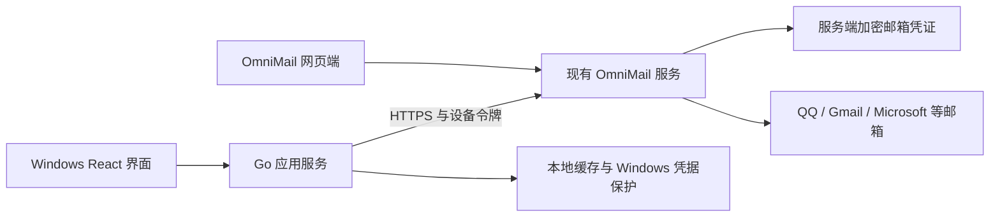

# OmniMail Windows 桌面端实施计划

更新日期：2026-09-06。状态：建议方案，尚未实施。

> 版本说明（2026-09-14）：本文为早期建议方案。Web 1.1.0 已新增桌面目录与凭据导入接口，
> 本文“不导出第三方凭据”等设计不再完整反映当前服务端能力；桌面客户端仍未交付，实施前
> 需要更新设计并重新核对凭据、权限及同步边界。

## 1. 产品目标与核心决策

首先交付连接现有 OmniMail 服务的 Windows 桌面端。用户输入实例地址并登录自己的
OmniMail 账户，即可使用网页端已连接的 QQ、Gmail、Microsoft 等邮箱，不必重复输入
第三方邮箱密码、授权码或 OAuth 凭证。

建议采用 Go + Wails v2 + React + TypeScript，在仓库新增独立的 `desktop/` 产品目录。
Windows 首期交付 x64 版本，主要验证 Windows 11，并覆盖 Windows 10 的兼容性；
ARM64 待后续具备真实设备验证条件后支持。桌面端使用独立版本与发布流程。

首期以服务端为数据和权限的权威来源。电脑直接连接 IMAP/SMTP 属于未来可选模式，
不纳入本期交付，也不为此提前建设第二套同步引擎。

## 2. 账号复用：同步连接信息，服务端继续使用凭证

用户希望减少重复输入，应通过复用已有邮箱连接实现：

1. 用户在网页端绑定 QQ 等邮箱，服务端保存加密凭证。
2. 桌面端登录同一个 OmniMail 账户，获取该设备自己的 Access / Refresh Token。
3. 桌面端获取邮箱来源、账号 ID、显示名称、连接状态和可用能力。
4. 桌面端请求邮件列表、正文、附件或发送接口，服务端使用已有凭证访问邮箱。
5. 网页端新增、删除或修复邮箱连接后，桌面端下次刷新账号列表即可反映变化。



仓库已经具备这条路径：`GET /api/qq-mail/accounts`、`GET /api/gmail/accounts`
支持 Access Token，返回脱敏账号及状态，不返回凭据或密文。见
[QQ API](../../docs/api/qq-mail.md) 与 [Gmail API](../../docs/api/gmail.md)。

不建议新增“下载全部邮箱密码”的接口：服务端密文依赖服务器密钥，复制密文本身不能
直接登录；复制明文或将解密密钥下发会增加凭证暴露面。OAuth 刷新令牌还可能轮换，
让网页服务和电脑分别维护同一组令牌会引入失效与并发问题。

这里的“网页和桌面共用账号”指共享服务端连接，桌面持有独立设备会话。撤销一个桌面
设备不会断开网页已经绑定的第三方邮箱。未来若需要本机直连，优先为该设备单独授权；
“第三方凭证跨设备转移”必须另行设计，不能通过同步服务器密钥实现。

## 3. 技术选型与取舍

| 部分 | 建议 | 原因与边界 |
| --- | --- | --- |
| 桌面框架 | Go + Wails v2 | Go 负责网络、会话、本地文件和系统集成；Wails 提供前后端绑定 |
| 前端 | React + TypeScript + Vite | 当前仓库已使用 React，优先复用类型、样式和业务表现层 |
| 基础组件 | 现有组件优先，缺口按需引入 shadcn/ui | 补充对话框、菜单、设置表单等，不一次性替换现有组件 |
| 样式与图标 | 延续现有 CSS 变量和 Lucide | 维持品牌、主题和交互一致性；需要 shadcn/ui 时再配置对应样式基础 |
| 查询状态 | 按需使用 TanStack Query | 通过 Wails 调用 Go，管理查询状态、失效和分页；持久化与后台同步归 Go |
| 大列表 | TanStack Virtual 候选 | 邮件列表按窗口渲染；以实测决定引入阶段 |
| 本地存储 | SQLite | 缓存元数据、同步状态和本地恢复草稿；驱动在原型阶段验证 Windows 构建 |
| 凭据保护 | Go 封装 Windows DPAPI | 保护本设备的 Refresh Token，不保存第三方邮箱凭证 |
| 写信编辑器 | 首期复用现有写信能力 | 支持正文和附件后，再评估富文本编辑器与邮件兼容性 |

Vue 3 同样可以使用，但现有 React 组件、Hook 和测试不能直接搬到 Vue。
若没有明确的 Vue 团队偏好，继续使用 React 的维护成本更低。

Wails 官方提供 React/Vue 模板与 Go/TypeScript 绑定；Windows 依赖 WebView2。
开发环境版本、Wails v2 CLI 和 Go module 版本在 M0 验证后固定，不能只根据模板默认值
升级仓库全部依赖。参考 [Wails 简介](https://v2.wails.io/docs/introduction/) 和
[安装要求](https://v2.wails.io/docs/gettingstarted/installation/)。

[shadcn/ui](https://ui.shadcn.com/docs)、
[TanStack Query](https://tanstack.com/query/latest/docs/framework/react/reference/index) 和
[TanStack Virtual](https://tanstack.com/virtual/latest/docs/introduction) 均为候选补充，
按实际缺口引入。原生托盘、系统通知和多窗口不能当作 Wails v2 已经完成的能力，
需要在选定版本上验证；首期以单主窗口和窗口内写信面板为基础。

## 4. 架构与目录

```text
desktop/
├─ README.md
├─ go.mod / go.sum             # 独立 Go 模块，实施时生成
├─ main.go                    # Wails 启动与依赖装配
├─ app.go                     # 小范围、明确类型的前端绑定
├─ wails.json
├─ internal/
│  ├─ auth/                   # 登录、刷新、设备会话
│  ├─ api/                    # OmniMail HTTP 客户端和来源适配
│  ├─ mail/                   # 阅读、草稿、操作与能力模型
│  ├─ sync/                   # 条件刷新、去重、通知调度
│  ├─ storage/                # SQLite、迁移和缓存策略
│  └─ platform/windows/       # DPAPI、通知、文件对话框
├─ frontend/
│  ├─ package.json
│  ├─ src/app/
│  ├─ src/features/           # auth、accounts、messages、compose、settings
│  ├─ src/shared/
│  └─ wailsjs/                # Wails 生成的绑定
├─ build/                     # 安装器配置；编译产物单独忽略
└─ docs/IMPLEMENTATION_PLAN.md
```

依赖方向：React 界面 → Wails 类型化方法 → Go 服务 → OmniMail API / 本地存储。
前端不持久化设备令牌；Go 不向前端暴露任意 URL 请求、任意文件读写或任意命令执行接口。
邮件附件通过受控下载方法和文件对话框处理，避免把大附件整体复制进 JavaScript 状态。

复用从邮件来源契约、日期/地址处理、主题、图标和纯展示组件开始。现有
`MessageReader` 等组件仍依赖 Web API、远程图片代理和浏览器行为，须注入桌面适配层
后再复用；不能直接复用 Cookie 登录和 Web 网络调用。
初期按少量明确入口共享，出现真实的多端复用需求后再提取公共包，避免全仓目录重构。

现有 [目录约定](../../docs/ARCHITECTURE.md) 继续适用。新增前端代码沿用
`features/shared` 分层、测试与实现相邻；构建、依赖和锁文件独立，桌面生成物不进入 Git。

## 5. 登录与服务端最小补充

### 登录体验

- 首次输入并保存 HTTPS 实例地址，检查配置和兼容能力，再提供登录入口。
- 基础路径复用 `/api/auth/token`，支持账号密码、TOTP/恢复码。
- 推荐提供“在浏览器中授权”：打开当前实例的授权页面，复用网页登录状态，确认后将
  一次性授权码交给桌面。这样仅使用 Linux DO 登录的账户也能使用桌面。
- 浏览器授权是待新增能力；现有扩展授权流程绑定了扩展身份和 Origin，不能直接套用。
  复用其校验逻辑时保留原有边界，新增独立的桌面授权与交换入口。
- 桌面授权采用 PKCE S256、state、短时单次授权码，以及绑定客户端和回调的校验。
  优先验证仅监听本机回环地址的临时端口，设置超时并关闭监听，不把令牌放进 URL。
- 账号连接失效时只标记对应来源需要修复；不会退出仍有效的 OmniMail 设备会话。

### 权限与兼容性

当前 `deviceScopesForClient` 只识别显式 Android 客户端，其他客户端默认获得 `*`。
桌面发布前新增显式 `desktop` 类型及独立的最小权限集合，覆盖本期邮件、草稿、
附件、来源账号读取、同步与通知；不包含管理员操作和第三方凭据导出。
具体依据见 [token-scope.ts](../../email-worker/src/features/auth/tokens/token-scope.ts)。

刷新只能维持或收紧权限，新功能需要额外权限时重新授权。
扩展现有路由权限映射时，逐项核对主邮箱原文下载、草稿附件、来源发送等接口，
避免仅增加 scope 名称却遗漏实际路由；设备列表、账户删除也不能随默认 scope 放行。

第一版桌面要求服务端具备桌面登录/权限能力。兼容性检查优先采用可机器判定的能力字段，
缺少能力时提示先升级实例，不静默回退为全权限令牌。
沿用现有 `/api/*`；新增返回字段与端点保持向后兼容，不改写现有 Web/Float 契约。

第三方账号新增、凭据更新与解绑首期通过系统浏览器打开该实例的对应管理页；
返回桌面时刷新账号信息。后续可按需补充原生表单，输入的新凭据直接提交服务端，
成功后不在本地保存。

## 6. 邮件功能与界面

推荐桌面三栏：左侧账号/文件夹，中间邮件列表，右侧阅读器；顶部搜索和写信，
设置页管理实例、通知、缓存和主题。支持可调整栏宽、小窗口双栏、浅色/深色主题、
键盘导航、右键菜单、多选和可见的同步状态，保持中文长标题与附件名可读。

以下为首期能力边界，最终以 API、实例开关、设备 scope 和用户权限的交集决定：

| 邮箱来源 | 桌面首期目标 | 当前边界 |
| --- | --- | --- |
| OmniMail 主邮箱 | 列表、搜索、阅读、已读/未读、星标、垃圾箱/恢复、批量操作、草稿、发送/回复/转发、附件 | 受发信权限、服务配置和附件限制约束；转发复用写信能力 |
| QQ | 复用账号、收信、正文/附件、读取后标已读、主动同步、发信/回复 | 目前不承诺远端删除、归档、移动或星标；发信附件能力另按 API 核对 |
| Gmail | 复用账号、收信、正文/附件、读取后标已读、主动同步 | 当前服务端不提供发送、归档、删除等操作 |
| Microsoft | 复用账号、收信、文件夹浏览、正文/附件、读取后标已读、主动同步 | 当前不提供发送、删除、移动等远端写操作 |
| iCloud、Linux DO、NAVER、Yandex | 分期接入已有账号和服务已支持的工作流 | 分别验收，不将某一来源的功能套给其他来源 |

现有 [来源兼容契约](../../extension/COMPATIBILITY.md) 是来源标识和基础能力的参考，
不把 Float 的能力矩阵直接当作整个服务端的完整接口清单。
桌面可以补充自己的操作能力模型，但不修改原有五个能力字段的语义。
没有能力的操作不提供入口；由于权限或配置导致暂时不可用时给出原因。

首期提供统一的来源导航与来源内账号切换。跨所有提供商合并的无限滚动收件箱后置，
需要先解决不同游标、重复标识、排序和来源局部失败，不能简单拼接第一页。
更完整的 Gmail/QQ 邮件管理作为服务端后续功能，两端共同受益。

## 7. 同步、缓存与安全

- 使用现有列表游标与 `version/unchanged` 能力；仅支持这些字段的来源采用条件请求，
  其他来源按各自接口适配。现有 API 未提供统一变更日志，不承诺完整增量或实时推送。
- Go 统一调度刷新，遵守实例刷新配置、来源同步节奏及 `Retry-After`。React 查询状态
  不再独立启动另一套后台轮询。窗口恢复时条件刷新，避免多来源同时高频请求。
- 缓存和通知标识至少包含实例、用户、来源、账号和邮件 ID；隔离不同账户和实例。
  来源移除、权限撤销或账号切换后，停止对应请求并清理不可再访问的数据。
- SQLite 先缓存列表和同步状态；正文按需缓存并提供容量/保留策略；附件默认按需下载。
  离线仅阅读已缓存内容和保留本地草稿，邮件状态更改及发送需联网。
- 第一版不做自动重放的离线发件箱。支持幂等键的发送接口必须复用原键重试；
  未确认幂等语义的来源在超时后显示结果待确认，不能自动重复提交。
- 草稿以服务端为权威，本地只保存未同步恢复副本；检测到另一端修改时保留恢复副本，
  不静默覆盖。同步成功、缓存中和仅本机保存必须在 UI 中区分。
- Access Token 放内存，Refresh Token 用当前 Windows 用户范围的 DPAPI 保护，
  刷新并发合并并原子更新。SQLite 本身不会因此自动加密；元数据在用户私有目录，
  敏感正文/恢复草稿采用独立受保护存储，明确缓存和下载文件的保留行为。
- 正文作为不可信输入处理：清洗 HTML、严格 CSP、禁止脚本/表单/顶层导航的隔离阅读框，
  邮件文档不能访问 Wails Go 绑定。远程图片默认关闭，允许时走受控读取路径。
- 请求由 Go 校验实例 HTTPS 地址、方法、路径、长度及响应大小；跨源重定向不携带令牌。
  外部链接只允许受支持协议并交给系统浏览器；不开放任意本地文件 URL。
- 附件校验尺寸、文件名、扩展名和保存路径，流式处理；不自动执行或打开下载内容。
  日志和诊断信息不得包含密码、Token、邮件正文或附件内容。
- 退出时撤销当前设备会话并清理本地凭据与缓存；离线退出先完成本地清理，并明确
  服务端撤销尚未完成，可在网页设备管理中撤销。用户主动保存的附件不随退出删除。

DPAPI 的账户/机器范围和行为依据
[Microsoft 文档](https://learn.microsoft.com/en-us/windows/win32/api/dpapi/nf-dpapi-cryptprotectdata)。
邮件阅读器必须在实际打包后的 WebView2 内做隔离验证，不能只凭普通浏览器测试认定安全。

## 8. 分阶段交付与验收

所有阶段均未开始；后续阶段以此前验收结果为基础，版本号独立于 Web/Android。

| 阶段 | 交付内容 | 完成标准 |
| --- | --- | --- |
| M0：技术原型 | 独立目录和构建、Wails/React 窗口、Go API 请求、DPAPI 与 WebView2 阅读隔离验证；托盘/通知可行性试验 | 打包后可运行；确认框架、SQLite 驱动和系统集成方案；确定最低服务端能力 |
| M1：可登录、可阅读 | 桌面专用 scope、密码/MFA 与浏览器授权；三栏布局；主邮箱和现有 QQ 账号列表、分页、正文、附件 | 同一用户网页登录已绑定 QQ 后，桌面无需再次输入 QQ 凭证；并发过期请求只触发一次刷新；Linux DO 账户可完成浏览器授权 |
| M2：日常可用，目标 v0.1 | 主邮箱搜索、已读/星标/垃圾箱、批量操作；草稿、发信/回复/转发和附件；QQ 现有发信能力；错误恢复 | 用户可完成阅读→回复→查看发送结果；跨端状态刷新一致；超时不会触发自动重复发送；权限与能力限制正确 |
| M3：多来源与离线，目标 v0.2 | Gmail、Microsoft，随后 iCloud/Linux DO/NAVER/Yandex；有界缓存、离线阅读、来源故障隔离 | 已绑定账号自动出现；一处修复凭据后两端恢复；缓存不串号；来源部分失败不阻断其他来源 |
| M4：Windows 发布体验，目标 v0.3 | 经验证的托盘、通知点击定位、快捷键、窗口记忆、安装器、版本检查、签名流程 | 安装/升级/卸载、WebView2 缺失处理、睡眠唤醒、高 DPI 与打包运行验收通过 |

按熟悉仓库的单名开发者连续投入粗估，M0–M2 约 2–3 周，M3–M4 约 2–3 周。
这是工作量估计，不是发布日期承诺；服务端授权改造、系统集成和真实账号兼容测试
可能调整工期。首个闭环优先级高于一次性支持全部邮箱。

通知默认隐藏邮件主题和正文，只显示新邮件数量；用户可自行选择详情级别。
应用运行或驻留托盘时才能轮询通知，完全退出后首期不保证后台收件通知。
自动启动是可选设置。首期版本检查打开可信发布页；静默自动更新、Windows 服务和
复杂多窗口后置。正式分发时落实代码签名，签名不能保证立即消除 SmartScreen 提示。
WebView2 安装策略参见 [Wails Windows 指南](https://wails.io/docs/guides/windows/)。

## 9. 最小充分验证

- Go：API 参数与错误分类、刷新并发/轮换失败、跨实例缓存隔离、下载路径和体积限制、
  发送超时处理、数据库迁移及退出清理。运行相关测试与 `go vet`。
- 前端：类型检查、构建；对能力开关、草稿恢复、错误提示和关键交互编写必要测试。
- 服务端：桌面 scope/浏览器授权契约、PKCE/state/回调/重放防护、用户归属检查；
  验证旧 Android/Float 登录授权不回归。API 文档从目录源生成，不直接手改生成文档。
- 集成：以受控测试服务覆盖登录→复用 QQ 账号→阅读→同步→退出；真实收发只使用
  明确授权的测试账号和收件人，并验证多端状态以及凭证失效恢复。
- 安全与桌面：恶意 HTML 无法触发 Go 方法、远程跟踪资源默认不请求、敏感字段不进日志；
  Windows 100%/150%/200% 缩放、键盘焦点、屏幕阅读器、休眠恢复和安装升级验证。
- 性能：用至少万封模拟元数据验证分页/虚拟列表，测量参考设备的冷启动、内存和交互耗时，
  在原型结果基础上制定预算，不提前宣称未经测量的性能数字。

当前仅新增本计划及目录说明，尚未修改服务端、初始化 Wails 工程、安装依赖或执行真实邮箱操作。
